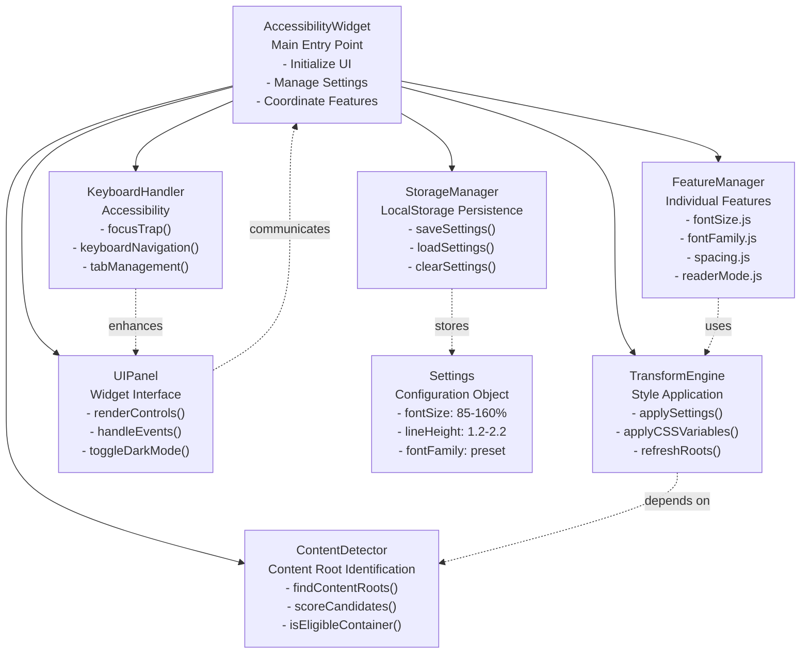
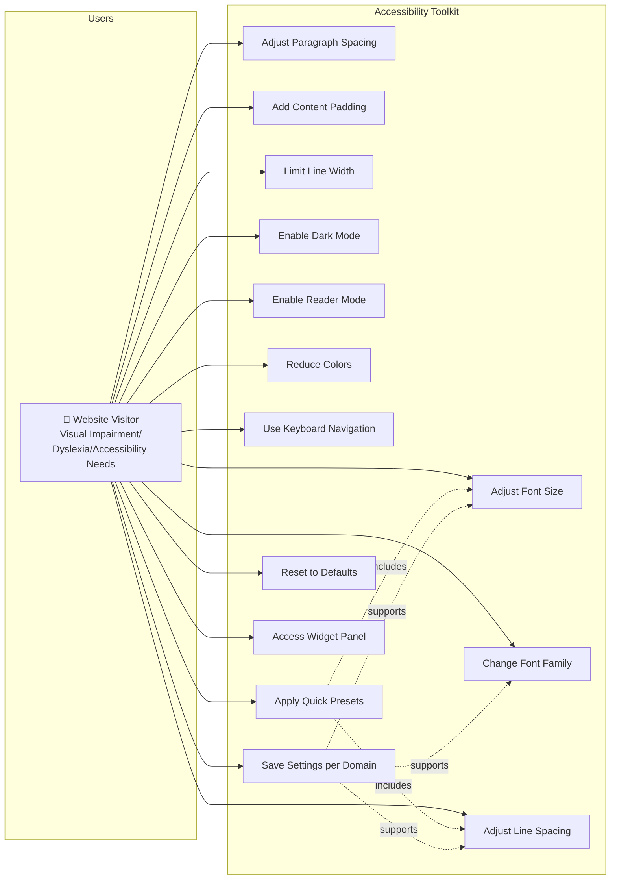
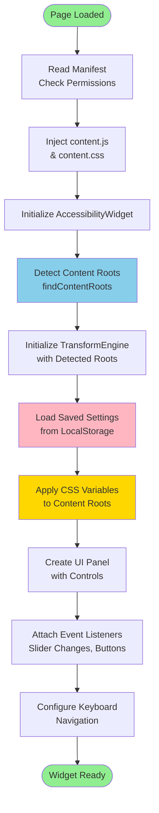
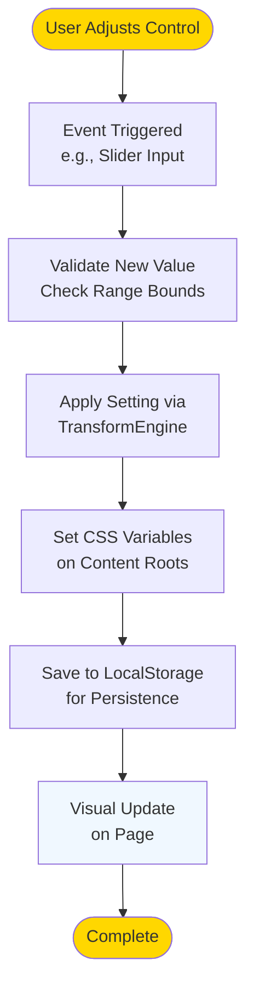
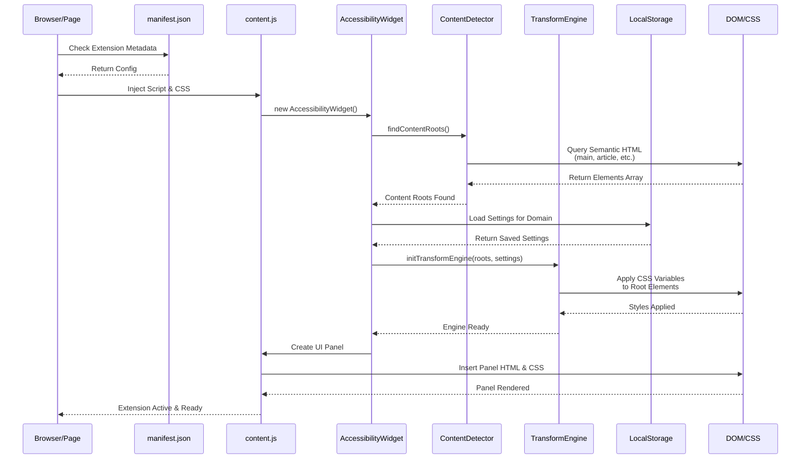
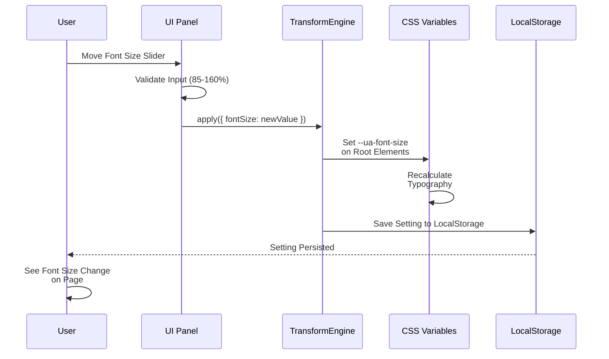
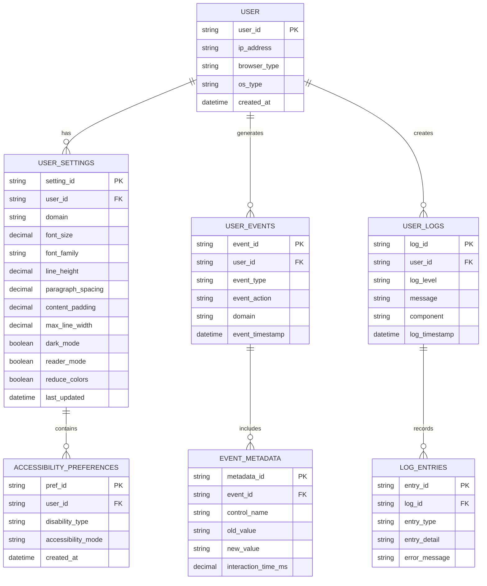
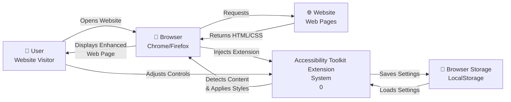
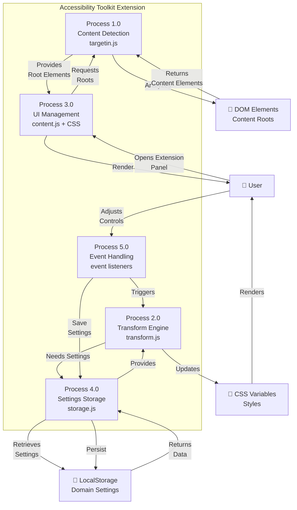

# Accessibility Toolkit - Diagrams & Specifications

## Table of Contents
1. [Class Diagram](#class-diagram)
2. [Use Case Diagram](#use-case-diagram)
3. [Activity Diagram](#activity-diagram)
4. [Sequence Diagram](#sequence-diagram)
5. [Entity-Relationship Diagram](#entity-relationship-diagram)
6. [DFD Level 0](#dfd-level-0-context-diagram)
7. [DFD Level 1](#dfd-level-1-detailed-diagram)
8. [Data Collections & Tables](#data-collections--tables)

---

## 1. Class Diagram

The Accessibility Toolkit extension has the following class/module structure:



---

## 2. Use Case Diagram



---

## 3. Activity Diagram

### Main Widget Initialization Flow



### User Setting Change Flow



---

## 4. Sequence Diagram

### Extension Load & Initialize Sequence



### User Adjusts Font Size Sequence



---

## 5. Entity-Relationship Diagram

### Data Entities & Relationships



---

## 6. DFD Level 0 (Context Diagram)

Shows the system as a single process and its external entities:



---

## 7. DFD Level 1 (Detailed Diagram)

Breaks down the system into detailed processes:



**Process Descriptions:**

| Process | Function | Input | Output | Technology |
|---------|----------|-------|--------|-----------|
| P1.0 | Content Detection | Webpage DOM | Content Root Elements | JavaScript DOM API |
| P2.0 | Transform Engine | Content Roots + Settings | CSS Variables Applied | CSS Custom Properties |
| P3.0 | UI Management | User Actions | Widget Panel + Controls | HTML/CSS/JavaScript |
| P4.0 | Settings Storage | Settings Data | Persisted Settings | LocalStorage API |
| P5.0 | Event Handling | User Input | Application Logic | Event Listeners |

---

## 8. Data Collections & Tables

### 1. User Events Table

**Status:** ✅ **POSSIBLE**

Tracks all user interactions with the accessibility toolkit.

| Column | Data Type | Description | Constraints |
|--------|-----------|-------------|------------|
| event_id | UUID/String | Unique event identifier | Primary Key |
| user_id | String | Browser User ID | Foreign Key |
| event_type | String | Type of event (e.g., 'slider_change', 'button_click', 'panel_open') | NOT NULL |
| event_action | String | Specific action performed | NOT NULL |
| control_name | String | Name of control affected (e.g., 'font_size_slider', 'dark_mode_toggle') | - |
| domain | String | Website domain where event occurred | - |
| old_value | String/Number | Previous value before change | - |
| new_value | String/Number | New value after change | - |
| interaction_time_ms | Integer | Time spent on this interaction | - |
| timestamp | DateTime | When event occurred (UTC) | NOT NULL, Default: NOW() |

**Sample Records:**
```json
{
  "event_id": "evt_001",
  "user_id": "usr_123",
  "event_type": "slider_change",
  "event_action": "adjusted",
  "control_name": "font_size_slider",
  "domain": "example.com",
  "old_value": "100",
  "new_value": "120",
  "interaction_time_ms": 450,
  "timestamp": "2026-02-14T10:30:00Z"
}
```

---

### 2. User Collections

**Status:** ✅ **POSSIBLE**

Stores user-specific collections (bookmarks, custom settings groups, accessibility profiles).

| Column | Data Type | Description | Constraints |
|--------|-----------|-------------|------------|
| collection_id | UUID/String | Unique collection identifier | Primary Key |
| user_id | String | Owner of the collection | Foreign Key, NOT NULL |
| collection_name | String | Name given by user (e.g., 'Office Settings', 'Reading Mode') | NOT NULL |
| description | Text | User-provided description | - |
| collection_type | String | Type: 'preset', 'saved_settings', 'website_group' | NOT NULL |
| settings_json | JSON | Serialized accessibility settings | - |
| websites_list | Array/JSON | Array of domains this collection applies to | - |
| is_default | Boolean | Is this the default collection? | Default: FALSE |
| created_at | DateTime | When collection was created | NOT NULL, Default: NOW() |
| updated_at | DateTime | Last modification timestamp | NOT NULL, Default: NOW() |

**Sample Records:**
```json
{
  "collection_id": "col_001",
  "user_id": "usr_123",
  "collection_name": "Dyslexia-Friendly Settings",
  "description": "Optimized for dyslexic reading",
  "collection_type": "preset",
  "settings_json": {
    "font_size": "120",
    "font_family": "dyslexia",
    "line_height": "1.8",
    "content_padding": "32",
    "dark_mode": true
  },
  "websites_list": ["medium.com", "news.bbc.com"],
  "is_default": false,
  "created_at": "2026-01-15T08:00:00Z",
  "updated_at": "2026-02-10T15:45:00Z"
}
```

---

### 3. Reports Collection

**Status:** ⚠️ **PARTIALLY POSSIBLE - REQUIRES BACKEND**

Analytics and usage reports. Currently limited to client-side analytics; server-side reporting is NOT YET IMPLEMENTED.

| Column | Data Type | Description | Constraints |
|--------|-----------|-------------|------------|
| report_id | UUID/String | Unique report identifier | Primary Key |
| user_id | String | User this report belongs to | Foreign Key |
| report_type | String | Type: 'usage', 'accessibility_profile', 'feature_usage', 'domain_analysis' | NOT NULL |
| report_title | String | Human-readable title | NOT NULL |
| report_period | String | Time period covered (e.g., '2026-02-01 to 2026-02-14') | NOT NULL |
| total_events | Integer | Total events in this period | - |
| unique_domains | Integer | Count of unique websites visited | - |
| most_used_feature | String | Feature used most frequently | - |
| average_session_duration_sec | Decimal | Average time spent using extension | - |
| top_settings_changes | JSON | JSON array of most common setting adjustments | - |
| report_data | JSON | Complete report payload | - |
| generated_at | DateTime | When report was generated | NOT NULL, Default: NOW() |

**Sample Records:**
```json
{
  "report_id": "rpt_001",
  "user_id": "usr_123",
  "report_type": "usage",
  "report_title": "Weekly Usage Report - Feb 7-14",
  "report_period": "2026-02-07 to 2026-02-14",
  "total_events": 127,
  "unique_domains": 18,
  "most_used_feature": "font_size_adjustment",
  "average_session_duration_sec": 340,
  "top_settings_changes": ["font_size", "line_height", "dark_mode"],
  "report_data": {
    "feature_breakdown": {
      "font_size_changes": 45,
      "dark_mode_toggles": 28,
      "reader_mode_uses": 12
    }
  },
  "generated_at": "2026-02-14T23:59:59Z"
}
```

**Limitation:** Currently NOT POSSIBLE without backend infrastructure. Client-side only collects data locally.

---

### 4. Extracted Text Collection

**Status:** ❌ **NOT POSSIBLE**

The Accessibility Toolkit does NOT extract or store text content from web pages. It only applies styling transformations.

**Why Not Possible:**
- Project scope is accessibility enhancement, NOT content extraction
- No OCR or text parsing functionality
- Privacy-first design: no content data stored or transmitted
- Reader mode displays content via DOM manipulation, not storage

**Alternative Approach:**
If text extraction is needed, a separate module would be required with:
- DOM traversal and text collection
- Content storage backend
- Privacy compliance (GDPR, etc.)

---

### 5. All Interpretations Collection

**Status:** ❌ **NOT POSSIBLE**

The Accessibility Toolkit does NOT perform text interpretation, NLP, or semantic analysis.

**Why Not Possible:**
- No machine learning or AI models integrated
- Project is DOM/CSS-based styling only
- No interpretation of page content or user intent
- Not in scope of accessibility enhancement

**Would Require:**
- NLP/AI backend service
- Language processing models
- Interpretation engine
- Separate architecture

---

### 6. Logs Collection

**Status:** ✅ **POSSIBLE - CLIENT-SIDE ONLY**

System logs for debugging and error tracking. Currently console-based; can be stored if backend is added.

| Column | Data Type | Description | Constraints |
|--------|-----------|-------------|------------|
| log_id | UUID/String | Unique log identifier | Primary Key |
| user_id | String | Associated user (if applicable) | - |
| log_level | String | Severity level: 'DEBUG', 'INFO', 'WARN', 'ERROR' | NOT NULL |
| component | String | Source component (e.g., 'ContentDetector', 'TransformEngine', 'UIPanel') | NOT NULL |
| message | String | Log message | NOT NULL |
| context | JSON | Additional context data | - |
| error_stack | Text | JavaScript error stack trace (if error) | - |
| browser_version | String | Browser and version info | - |
| extension_version | String | Extension version number | - |
| domain | String | Website domain at time of log | - |
| timestamp | DateTime | When log was created (UTC) | NOT NULL, Default: NOW() |

**Sample Records:**
```json
{
  "log_id": "log_001",
  "user_id": "usr_123",
  "log_level": "INFO",
  "component": "ContentDetector",
  "message": "Content roots detected successfully",
  "context": {
    "roots_found": 2,
    "detection_method": "semantic_html"
  },
  "browser_version": "Chrome 126.0.6478.126",
  "extension_version": "1.1.0",
  "domain": "example.com",
  "timestamp": "2026-02-14T10:25:33Z"
}
```

```json
{
  "log_id": "log_002",
  "log_level": "ERROR",
  "component": "TransformEngine",
  "message": "Failed to apply CSS variables",
  "error_stack": "Error: Root element not found in DOM\n at applySettings(...)",
  "browser_version": "Chrome 126.0.6478.126",
  "extension_version": "1.1.0",
  "domain": "dynamic-spa.com",
  "timestamp": "2026-02-14T10:26:15Z"
}
```

---

### 7. Test Cases Table

**Status:** ✅ **POSSIBLE**

Test cases for QA and continuous integration testing.

| Test ID | Component | Test Category | Test Name | Precondition | Steps | Expected Result | Status |
|---------|-----------|---------------|-----------|--------------|-------|-----------------|--------|
| TC_001 | ContentDetector | Functional | Detect main content on semantic HTML page | Page with `<main>` tag loaded | 1. Inject extension 2. Call findContentRoots() | Returns correct main element | ✅ Pass |
| TC_002 | ContentDetector | Functional | Detect content fallback (non-semantic pages) | Page without semantic tags | 1. Inject extension 2. Call findContentRoots() | Returns scored candidate elements | ✅ Pass |
| TC_003 | TransformEngine | Functional | Apply font size CSS variable | Content roots available, fontSize=120 | 1. Initialize engine 2. Call apply({fontSize: 120}) | --ua-font-size: 120% applied to roots | ✅ Pass |
| TC_004 | TransformEngine | Boundary | Font size min boundary (85%) | Engine initialized | 1. Call apply({fontSize: 80}) | Value clamped to 85% | ✅ Pass |
| TC_005 | TransformEngine | Boundary | Font size max boundary (160%) | Engine initialized | 1. Call apply({fontSize: 180}) | Value clamped to 160% | ✅ Pass |
| TC_006 | UIPanel | Functional | Open widget panel | Extension loaded | 1. Click launcher button | Panel displays, visible and focused | ✅ Pass |
| TC_007 | UIPanel | Functional | Close widget panel | Panel is open | 1. Click close button (X) | Panel hidden, launcher button visible | ✅ Pass |
| TC_008 | UIPanel | Functional | Dark mode toggle | Panel open | 1. Click dark mode button 2. Verify styles | Panel switches to dark theme | ✅ Pass |
| TC_009 | StorageManager | Functional | Save settings to localStorage | User adjusts a slider | 1. Change font size 2. Check localStorage | Settings stored with domain key | ✅ Pass |
| TC_010 | StorageManager | Functional | Load settings from localStorage | Page reloaded with saved settings | 1. Open extension 2. Load domain settings | Previous settings restored | ✅ Pass |
| TC_011 | KeyboardHandler | Functional | Tab navigation within panel | Panel open, focus outside | 1. Press Tab key | Focus moves between controls in order | ✅ Pass |
| TC_012 | KeyboardHandler | Functional | Escape key closes panel | Panel open and focused | 1. Press Escape key | Panel closes, launcher button focused | ✅ Pass |
| TC_013 | Integration | Functional | End-to-end: Adjust font and persist | Fresh extension load | 1. Open panel 2. Change font size to 130 3. Reload page | Settings persist after reload | ✅ Pass |
| TC_014 | Integration | Functional | Reader mode display | Article page loaded | 1. Open panel 2. Click reader mode | Reader view displays clean article layout | ✅ Pass |
| TC_015 | Integration | Compatibility | Chrome browser | Chrome 120+ | 1. Install extension 2. Test all features | All features work correctly | ✅ Pass |
| TC_016 | Integration | Compatibility | Firefox browser | Firefox 121+ | 1. Install extension 2. Test all features | All features work correctly | ✅ Pass |
| TC_017 | Performance | Performance | Content detection < 500ms | Large document (10000+ words) | 1. Call findContentRoots() 2. Measure time | Execution completes in <500ms | ✅ Pass |
| TC_018 | Performance | Performance | CSS application < 200ms | Multiple root elements (10+) | 1. apply() with multiple settings | DOM update completes in <200ms | ✅ Pass |
| TC_019 | Accessibility | Accessibility | WCAG 2.1 AA Compliance | Panel open | 1. Run axe accessibility scan | No critical violations | ✅ Pass |
| TC_020 | Security | Security | No XSS vulnerabilities | User input in panel | 1. Input special characters 2. Check DOM | Input properly escaped, no script execution | ✅ Pass |

---

## Summary Status

| Item | Status | Notes |
|------|--------|-------|
| Class Diagram | ✅ Complete | 8 main classes/modules |
| Use Case Diagram | ✅ Complete | 14 primary use cases |
| Activity Diagram | ✅ Complete | 2 main flows (init + setting change) |
| Sequence Diagram | ✅ Complete | 2 key sequences |
| E-R Diagram | ✅ Complete | 6 entities with relationships |
| DFD Level 0 | ✅ Complete | System context view |
| DFD Level 1 | ✅ Complete | 5 detailed processes |
| User Events Table | ✅ Complete | Trackable events |
| User Collections | ✅ Complete | Preset management |
| Reports Collection | ⚠️ Partial | Requires backend infrastructure |
| Extracted Text | ❌ Not Possible | Out of scope for styling toolkit |
| Interpretations | ❌ Not Possible | No NLP/AI in this project |
| Logs Collection | ✅ Complete | Client-side logging available |
| Test Cases | ✅ Complete | 20 comprehensive test cases |

---

## Notes

- **Backend Required:** Reports, Analytics, and multi-user synchronization would require backend infrastructure not currently in scope.
- **Privacy First:** The extension stores data only locally in the browser; no telemetry is transmitted.
- **Client-Side Only:** All processing (detection, styling, UI) happens on the client side.
- **Extensible Design:** The modular architecture allows easy addition of new features without restructuring core components.

---

*Document Generated: February 14, 2026*  
*Project: Accessibility Toolkit - Browser Extension v1.1.0*
